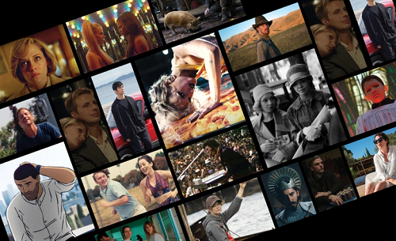
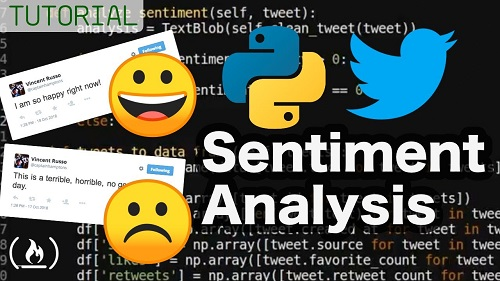
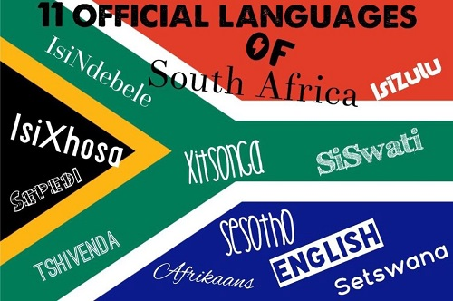

# Data Portfolio

<h2 id='toc'>Table of Contents</h2>

1. <a href='#introduction'> Introduction </a>

2. <a href='#projects'> My Projects </a>

    - <a href='#cost-optimizer'>Grocery Shopping Cost Optimizer</a>

    - <a href='#movie-recommender'>Movie Recommender System</a>

    - <a href='#tweets-sentiments'>Tweets Sentiment Analysis</a>

    - <a href='#sa-langs'>South African Languages Classification</a>

    - <a href='#spain-electricity'>Spain Electricity Load Shortfall</a>

<h2 id='introduction'>Introduction</h2>

**<a href='#toc'>back to table of contents</a>**

Hello, my name is **Michael Bidemi Dairo** and welcome to my portfolio repository which hosts all of my Data Science and Data Analysis projects that I have worked or I am currently working on. This repository will be updated regularly as I take on new challenges and conquer them all - so keep an eye out. :smile: :star:

The projects in this repository are mostly written in the Python programming language and in the Jupyter notebook environment. If anything changes in the nearest future, you'll be the first to know.

For more information about me, visit my [website](https://michael-py.github.io/) or view my [resume](https://drive.google.com/file/d/1dgYYUh4Oy4PEonepn6HRcB5Jr3a8l-JX/view?usp=sharing). Please contact me on [LinkedIn](https://linkedin.com/in/michaelbidemidairo) if you are looking to hire a data scientist or data analyst.

<h2 id='projects'>My Projects</h2>

**<a href='#toc'>back to table of contents</a>**

**<h3 id='cost-optimizer'><a href="https://github.com/Michael-py/Grocery-Shopping-Optimizer">1. Grocery Shopping Cost Optimizer</a></h3>**

**<a href='#toc'>back to table of contents</a>**

Grocery shoppers struggle to determine the availability of item at grocery stores, and most times do not take advantage of price disparity and promos to get the best deals.

It becomes imperative to develop a service that provides shopper with the most current deals and price information of items to improve their shopping experience and reduce cost.

As part of a team, we came up with a solution that allows grocery shoppers to select the items they wish to purchase and recommends which store gives the best value for money for the same type and number of items.

#### **HOW IT WORKS**

- A user selects products they are interested in purchasing
- The algorithm runs and scrapes data from all stores of interest and checks if an item is on sale or promo.
- If an item is on sale or promo, the sale price or the promo price is considered for that item.
- A list of products is displayed to the user sorted from the cheapest to the costliest.
- The user selects which products they want from each store
- The algorithm takes this as input and compares the prices of the products accross all stores, and recommends the store that gives the best value for the user's money.

The stores of interest for this project include;

1. **[Shoprite](shoprite.co.za)**
2. **[Checkers](checkers.co.za)**
3. **[Pick 'n Pay](pnp.co.za)**
4. **[Woolworths](woolworths.co.za)**

Range of products for this project include;

1. Rice - _1kg, 2kg, 5kg, e.t.c_
2. Sugar - _1kg, 2kg, e.t.c_
3. Flour - _1kg, 2kg, e.t.c_
4. Salt - _Fine, Coarse, Sea salts e.t.c_
5. Meat such as, _beef, chicken, pork_

This project is still in its prototype phase with quite a lot to still improve on. But, you can check out the project script [Here](https://github.com/Michael-py/Grocery-Shopping-Optimizer) and try it out for yourself.

Data for this project was scrapped.

__Tools:__ _Python, requests, BeautifulSoup, Selenium, Django web framework, Pandas_

__Methods:__ _Web scraping, Algorithm, Python scripting_

**<h3 id='movie-recommender'><a href="https://github.com/Michael-py/Movie_Recommendation_System">2. Movie Recommender Systems</a></h3>**

**<a href='#toc'>back to table of contents</a>**

Recommender systems are the unsung heroes of our modern technological world. Search engines, online shopping, streaming multimedia platforms, news-feeds - all of these services depend on recommendation algorithms in order to provide users the content they want to interact with.

At a fundamental level, these systems operate using similarity, where we try to match people (users) to things (items). Two primary approaches are used in recommender systems are content-based and collaborative-based filtering. In content-based filtering this similarity is measured between items based on their properties, while collaborative filtering uses similarities amongst users to drive recommendations.

This was a particularly interesting project for me because I love seeing movies - great quality movies, and would always wondered how movie platforms would know just the right movies to suggest to me. Having carried out this project, I now have a more indepth understanding of how it is all done. It's not magic, it's science - well, science is magic, so ...

Data for this project was gotten from Kaggle.

__Tools:__ _Pandas, numpy, matplotlib, Scikit-learn, Surprise, Scipy, Regex, NLTK, SVD_

__Method:__ _Machine learning, Unsupervised Learning, Recommender Systems_

**<h3 id='tweets-sentiments'><a href="https://github.com/Michael-py/tweets_sentiment_analysis">3. Tweets Sentiment Analysis</a></h3>**

**<a href='#toc'>back to table of contents</a>**

Many companies are built around lessening one’s environmental impact or carbon footprint. They offer products and services that are environmentally friendly and sustainable, in line with their values and ideals. They would like to determine how people perceive climate change and whether or not they believe it is a real threat. This would add to their market research efforts in gauging how their product/service may be received.

With this context, I created a Machine Learning model that is able to classify whether or not a person believes in climate change, based on their novel tweet data.

Providing an accurate and robust solution to this task gives companies access to a broad base of consumer sentiment, spanning multiple demographic and geographic categories - thus increasing their insights and informing future marketing strategies.

This problem was approached using Natural Language Processing techniques to clean and structure the highly unclean and unstructured tweets text data into a proper form that can be fed into our algorithms. The cleaned and structured dataset was modelled using different Machine Learning Classification Algorithms and predictions were made to successfully classify a tweet into one of the four (4) sentiment classes, namely; positive, negative, neutral and factual. An accuracy of 75% was recorded from the best performing algorithm.

Data for this project was gotten from Kaggle.

__Tools:__ _Pandas, numpy, matplotlib, Scikit-learn, NLTK, Imblearn (ADASYN, SMOTE), TFIDFVectorizer, CountVectorizer, WordNetLemmatizer, PorterStemmer, LogisticRegression, RandomForestClassifier, Support Vector Classifier (SVC), MultinomialNB, GaussianNB_

__Method:__ _Machine learning, Supervised Learning, Classification_

**<h3 id='sa-langs'><a href="https://github.com/Michael-py/South_African_Languages_Classification">4. South African Languages Classification</a></h3>**

**<a href='#toc'>back to table of contents</a>**

South Africa is a multicultural society that is characterised by its rich linguistic diversity. Language is an indispensable tool that can be used to deepen democracy and also contribute to the social, cultural, intellectual, economic and political life of the South African society.

The country is multilingual with 11 official languages, each of which is guaranteed equal status. Most South Africans are multilingual and able to speak at least two or more of the official languages.

In this challenge, text which is in any of South Africa's 11 Official languages is to be taken and identified as to which language the text is in.

This was a text classification problem. As such, Natural Language Processing techniques were employed to clean the data and engineer new features. Finally Supervised Machine Learning Algorithms were used to model and successfully classify a language text into its appropriate language class with a `96%` accuracy on datasets the algorithms had not yet seen.

Data for this project was gotten from Kaggle.

__Tools:__ _Pandas, numpy, matplotlib, Scikit-learn, NLTK, CountVectorizer, MultinomialNB, LogisticRegression, RandomForestClassifier,GradientBoostingClassifier, Support Vector Classifier (SVC), LinearSVC_

__Method:__ _Machine learning, Supervised Learning, Classification_

**<h3 id='spain-electricity'><a href="https://github.com/Michael-py/Spain_Electricity_Load_Shortfall">5. Spain Electricity Load Shortfall</a></h3>**

**<a href='#toc'>back to table of contents</a>**

The supply of electricity plays a large role in the livelihood of citizens in a country. Electricity, amongst other things, helps us stay connected, keep warm, and feed our families. Therefore there's a need to keep the lights on in order to maintain and improve the standard of living by investing in electricity infrastructure. However, in recent years, there has been evidence that the use of purely non-renewable sources is not sustainable. The government of Spain is considering an expansion of its renewable energy resource infrastructure investments. As such, they require information on the trends and patterns of the country's renewable sources and fossil fuel energy generation. For this very reason, the government of Spain has been tracking the different energy sources available within the country.

in this project, the task was to model the shortfall between the energy generated by means of fossil fuels and various renewable sources, for the country of Spain.

This problem was tackled using advanced regression machine learning technique to make predictions on the 3 hourly load shortfall to assist the government of spain identify what conditions lead to the generation of more electricity from fossil fuels than from renewable energy and at what time periods does this phenomenon occur.

The best performing model was Support Vector Regressor (SVR), a member in the family of the Support Vector Machines (SVM) with a Root Mean Square Error (RMSE) of `2829.73`

Data for this project was gotten from Kaggle.

__Tools:__ _Pandas, numpy, matplotlib, Scikit-learn, Support Vector Regressor (SVR), DecisionTreeRegressor, RandomForestRegressor, Lasso Regressor, Rigde Regressor_

__Method:__ _Machine learning, Supervised Learning, Regression_
